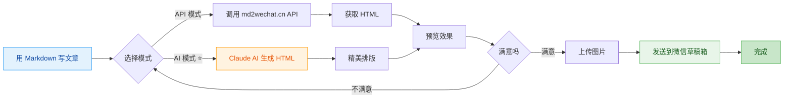
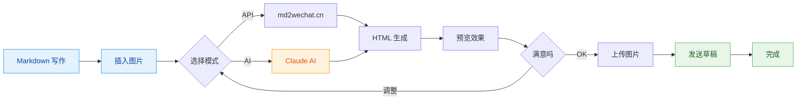
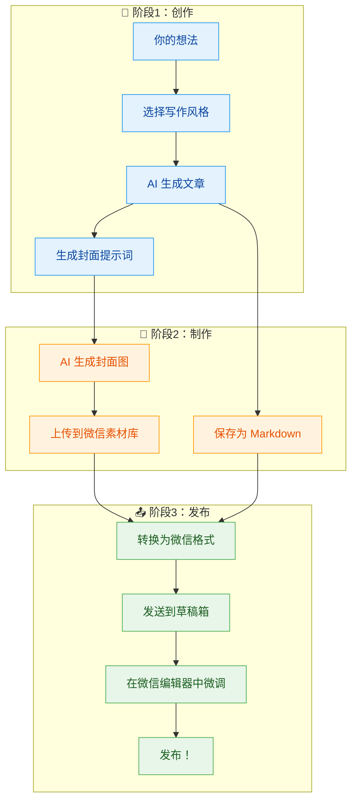
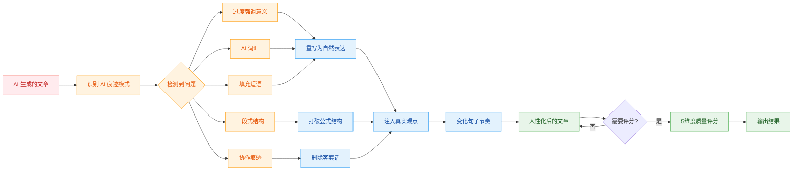

# md2wechat

<div align="center">

**用 Markdown 写公众号文章，像发朋友圈一样简单**

[](https://golang.org)
[](LICENSE)
[](https://github.com/geekjourneyx/md2wechat-skill/releases)
[](#-claude-code-集成)
[](#-openclaw-支持)
[![zread](https://img.shields.io/badge/Ask_Zread-_.svg?style=flat&color=00b0aa&labelColor=000000&logo=data%3Aimage%2Fsvg%2Bxml%3Bbase64%2CPHN2ZyB3aWR0aD0iMTYiIGhlaWdodD0iMTYiIHZpZXdCb3g9IjAgMCAxNiAxNiIgZmlsbD0ibm9uZSIgeG1sbnM9Imh0dHA6Ly93d3cudzMub3JnLzIwMDAvc3ZnIj4KPHBhdGggZD0iTTQuOTYxNTYgMS42MDAxSDIuMjQxNTZDMS44ODgxIDEuNjAwMSAxLjYwMTU2IDEuODg2NjQgMS42MDE1NiAyLjI0MDFWNC45NjAxQzEuNjAxNTYgNS4zMTM1NiAxLjg4ODEgNS42MDAxIDIuMjQxNTYgNS42MDAxSDQuOTYxNTZDNS4zMTUwMiA1LjYwMDEgNS42MDE1NiA1LjMxMzU2IDUuNjAxNTYgNC45NjAxVjIuMjQwMUM1LjYwMTU2IDEuODg2NjQgNS4zMTUwMiAxLjYwMDEgNC45NjE1NiAxLjYwMDFaIiBmaWxsPSIjZmZmIi8%2BCjxwYXRoIGQ9Ik00Ljk2MTU2IDEwLjM5OTlIMi4yNDE1NkMxLjg4ODEgMTAuMzk5OSAxLjYwMTU2IDEwLjY4NjQgMS42MDE1NiAxMS4wMzk5VjEzLjc1OTlDMS42MDE1NiAxNC4xMTM0IDEuODg4MSAxNC4zOTk5IDIuMjQxNTYgMTQuMzk5OUg0Ljk2MTU2QzUuMzE1MDIgMTQuMzk5OSA1LjYwMTU2IDE0LjExMzQgNS42MDE1NiAxMy43NTk5VjExLjAzOTlDNS42MDE1NiAxMC42ODY0IDUuMzE1MDIgMTAuMzk5OSA0Ljk2MTU2IDEwLjM5OTlaIiBmaWxsPSIjZmZmIi8%2BCjxwYXRoIGQ9Ik0xMy43NTg0IDEuNjAwMUgxMS4wMzg0QzEwLjY4NSAxLjYwMDEgMTAuMzk4NCAxLjg4NjY0IDEwLjM5ODQgMi4yNDAxVjQuOTYwMUMxMC4zOTg0IDUuMzEzNTYgMTAuNjg1IDUuNjAwMSAxMS4wMzg0IDUuNjAwMUgxMy43NTg0QzE0LjExMTkgNS42MDAxIDE0LjM5ODQgNS4zMTM1NiAxNC4zOTg0IDQuOTYwMVYyLjI0MDFDMTQuMzk4NCAxLjg4NjY0IDE0LjExMTkgMS42MDAxIDEzLjc1ODQgMS42MDAxWiIgZmlsbD0iI2ZmZiIvPgo8cGF0aCBkPSJNNCAxMkwxMiA0TDQgMTJaIiBmaWxsPSIjZmZmIi8%2BCjxwYXRoIGQ9Ik00IDEyTDEyIDQiIHN0cm9rZT0iI2ZmZiIgc3Ryb2tlLXdpZHRoPSIxLjUiIHN0cm9rZS1saW5lY2FwPSJyb3VuZCIvPgo8L3N2Zz4K&logoColor=ffffff)](https://zread.ai/geekjourneyx/md2wechat-skill)

---

> ### ⚠️ 重要提示：API 模式需要 md2wechat.cn API 服务
> **本工具使用 md2wechat.cn API 服务，使用 API 模式前需要先获取 API Key**
>
> - 📖 **API 文档**：https://www.md2wechat.cn/api-docs
> - 📧 **联系获取**：通过 [官网](https://www.md2wechat.cn/api-docs) 联系获取 API Key
> - 💡 **AI 模式**：不需要 API Key，直接使用 Claude 即可

---

> ### 🎉 API 服务重磅升级 - 内测招募
> **YouMind 内置主题，全新分类系统，重塑内容创作体验**
>
> md2wechat API 服务即将迎来重大升级，带来 **YouMind 内置主题库**和**全新主题分类**：
> - 🎨 **丰富主题库**：精选 YouMind 内置主题，覆盖科技、生活、商业等多元场景
> - 📂 **全新分类**：智能分类系统，快速定位最匹配的主题风格
> - ⚡ **一键应用**：API 模式下直接调用主题，创作更高效
>
> 📚 **主题预览**: [https://md2wechat.app/theme-gallery](https://md2wechat.app/theme-gallery)
>
> 🔥 **目前处于内测阶段，诚邀自动化 Agent 创作者参与测试！**
>
> - 🎯 **适合对象**：Agent 开发者、自动化内容创作者、API 集成者
> - 🎁 **内测福利**：优先体验新功能，影响产品方向
> - 📩 **参与方式**：扫描底部公众号二维码联系，备注「API内测」

---

[快速开始](#-5分钟快速上手) • [Claude Code](#-claude-code-集成) • [OpenClaw](#-openclaw-支持) • [功能介绍](#-核心功能) • [使用说明](#-使用方法) • [常见问题](#-常见问题)

---

## 🚀 Claude Code 用户（推荐）

在 Claude Code 中运行以下命令即可使用：

```bash
/plugin marketplace add geekjourneyx/md2wechat-skill
/plugin install md2wechat@geekjourneyx-md2wechat-skill
```

然后直接对话：**"请用秋日暖光主题将 article.md 转换为微信公众号格式"**

</div>

## ✨ 这是什么？

**md2wechat** 是一个让你的微信公众号写作更高效的神器。

> 💡 **一句话理解**：用 Markdown 写文章 → 一键转换 → 自动发到微信草稿箱

**适合谁用？**

| 你是 | 痛点 | md2wechat 帮你 |
|------|------|---------------|
| 📝 内容创作者 | 微信编辑器太难用，排版花时间 | Markdown 写作，自动排版 |
| 💼 产品经理 | 要发公告，但不会 HTML | 不用学代码，一行命令搞定 |
| 👨‍💻 程序员 | 习惯 Markdown，讨厌微信编辑器 | 保持你的写作习惯 |
| 🤖 AI 用户 | 用 AI 生成内容，但要手动复制粘贴 | AI 生成 → 微信草稿，无缝衔接 |

---

## 🎯 核心功能



### 五大核心功能

| 功能 | 命令 | 说明 | 适合谁 |
|------|------|------|--------|
| **Markdown 转换** | `convert` | 将 Markdown 转换为微信格式 HTML | 所有用户 |
| **风格写作** | `write` | 用创作者风格辅助写作，自动生成文章和封面提示词 | 写作小白、内容创作者 |
| **AI 去痕** | `humanize` | 去除 AI 生成痕迹，让文章听起来更自然、像人写的 | AI 写作用户 |
| **小绿书** 🆕 | `create_image_post` | 创建图片消息（小绿书），最多 20 张图片 | 图片内容创作者 |
| **草稿推送** | `convert --draft` | 一键发送到微信草稿箱 | 需要频繁发布的用户 |

**`write` 与 `convert` 的区别：**

| 对比项 | `write` 命令 | `convert` 命令 |
|--------|-------------|---------------|
| **输入** | 一个想法/观点/片段 | 完整的 Markdown 文件 |
| **输出** | 结构化提示词（AI 处理后生成文章） | 微信格式 HTML |
| **用途** | 从零开始创作 | 格式转换已有内容 |
| **封面** | 自动生成封面提示词 | 需要手动指定封面图 |

**简单理解：**
- `write` = 帮你写文章（从想法到完整文章）
- `convert` = 帮你排版（从 Markdown 到微信格式）

### 两种转换模式

| 模式 | 适合谁 | 特点 | 样式 |
|------|--------|------|------|
| **API 模式** | 追求稳定、快速 | 调用 md2wechat.cn API，秒级响应 | 简洁专业 |
| **AI 模式** ⭐ | 追求精美排版 | Claude AI 生成，样式更丰富 | 秋日暖光 / 春日清新 / 深海静谧 |

### 完整工作流程



---

## 🚀 5分钟快速上手

### 第一步：下载软件

> 💡 **最新版本**：访问 [Releases 页面](https://github.com/geekjourneyx/md2wechat-skill/releases) 下载

| 你的系统 | 下载链接 | 安装位置 |
|----------|----------|----------|
| 🪟 **Windows** | [下载 .exe](https://github.com/geekjourneyx/md2wechat-skill/releases/latest/download/md2wechat-windows-amd64.exe) | 任意文件夹（或 `C:\Windows\System32\`） |
| 🍎 **Mac Intel 芯片** | [下载](https://github.com/geekjourneyx/md2wechat-skill/releases/latest/download/md2wechat-darwin-amd64) | `/usr/local/bin/` 或 `~/.local/bin/` |
| 🍎 **Mac Apple Silicon (M1/M2/M3/M4)** | [下载](https://github.com/geekjourneyx/md2wechat-skill/releases/latest/download/md2wechat-darwin-arm64) | `/usr/local/bin/` 或 `~/.local/bin/` |
| 🐧 **Linux (Intel/AMD)** | [下载](https://github.com/geekjourneyx/md2wechat-skill/releases/latest/download/md2wechat-linux-amd64) | `/usr/local/bin/` 或 `~/.local/bin/` |
| 🐧 **Linux (ARM/树莓派)** | [下载](https://github.com/geekjourneyx/md2wechat-skill/releases/latest/download/md2wechat-linux-arm64) | `/usr/local/bin/` 或 `~/.local/bin/` |

> 🔍 **如何确认 Mac 芯片类型？**
> - 点击屏幕左上角 **苹果图标** → **关于本机**
> - 查看「芯片」或「处理器」信息：
>   - 显示 `Apple M1/M2/M3/M4` → 下载 **Apple Silicon** 版本
>   - 显示 `Intel` → 下载 **Intel** 版本

**安装步骤**：

<details>
<summary><b>Windows 安装方法</b></summary>

1. 下载 `md2wechat-windows-amd64.exe`
2. 重命名为 `md2wechat.exe`（可选）
3. 放到任意文件夹，或复制到 `C:\Windows\System32\`（全局可用）
4. 打开 CMD 或 PowerShell，输入 `md2wechat --help` 测试

</details>

<details>
<summary><b>Mac 安装方法</b></summary>

**请根据你的芯片类型选择对应命令：**

**Apple Silicon (M1/M2/M3/M4)：**
```bash
# 下载并移动到系统目录
curl -Lo md2wechat https://github.com/geekjourneyx/md2wechat-skill/releases/latest/download/md2wechat-darwin-arm64
chmod +x md2wechat
sudo mv md2wechat /usr/local/bin/

# 测试
md2wechat --help
```

**Intel 芯片：**
```bash
# 下载并移动到系统目录
curl -Lo md2wechat https://github.com/geekjourneyx/md2wechat-skill/releases/latest/download/md2wechat-darwin-amd64
chmod +x md2wechat
sudo mv md2wechat /usr/local/bin/

# 测试
md2wechat --help
```

**用户目录安装（无需 sudo）：**
```bash
# Apple Silicon
mkdir -p ~/.local/bin
curl -Lo ~/.local/bin/md2wechat https://github.com/geekjourneyx/md2wechat-skill/releases/latest/download/md2wechat-darwin-arm64
chmod +x ~/.local/bin/md2wechat

# Intel 芯片（将上面 URL 中的 arm64 改为 amd64）

# 添加到 PATH（如果还没有）
echo 'export PATH="$HOME/.local/bin:$PATH"' >> ~/.zshrc
source ~/.zshrc

# 测试
md2wechat --help
```

</details>

<details>
<summary><b>Linux 安装方法</b></summary>

**请根据你的架构选择对应命令：**

**Intel/AMD (x86_64)：**
```bash
# 下载并移动到系统目录
curl -Lo md2wechat https://github.com/geekjourneyx/md2wechat-skill/releases/latest/download/md2wechat-linux-amd64
chmod +x md2wechat
sudo mv md2wechat /usr/local/bin/

# 测试
md2wechat --help
```

**ARM/树莓派 (aarch64)：**
```bash
# 下载并移动到系统目录
curl -Lo md2wechat https://github.com/geekjourneyx/md2wechat-skill/releases/latest/download/md2wechat-linux-arm64
chmod +x md2wechat
sudo mv md2wechat /usr/local/bin/

# 测试
md2wechat --help
```

**用户目录安装（无需 sudo）：**
```bash
mkdir -p ~/.local/bin
# Intel/AMD 用 amd64，ARM 用 arm64
curl -Lo ~/.local/bin/md2wechat https://github.com/geekjourneyx/md2wechat-skill/releases/latest/download/md2wechat-linux-amd64
chmod +x ~/.local/bin/md2wechat

# 添加到 PATH（如果还没有）
echo 'export PATH="$HOME/.local/bin:$PATH"' >> ~/.bashrc  # 或 ~/.zshrc
source ~/.bashrc

# 测试
md2wechat --help
```

</details>

> ⚠️ **Mac 用户**：下载后如果提示「无法打开」，右键点击 → 打开 → 仍要打开

### 第二步：配置微信（只需一次）

```bash
md2wechat config init
```

用记事本打开生成的配置文件（会显示路径），填入两个信息：

| 配置项 | 是什么 | 在哪获取 |
|--------|--------|----------|
| AppID | 公众号唯一标识 | [微信开发者平台](https://developers.weixin.qq.com/platform) → 开发接口管理 |
| Secret | API 密钥 | 同上，需要管理员权限 |

### 第三步：开始使用

```bash
# 1. 用 Markdown 写好文章（假设文件叫 article.md）

# 2. 预览效果
md2wechat convert article.md --preview

# 3. 发送到微信草稿箱
md2wechat convert article.md --draft --cover cover.jpg
```

> 💡 **小贴士**：第一次使用时，命令会自动引导你完成配置。

---

## 📖 使用方法

### 基础命令

```bash
# 预览转换效果（不发送）
md2wechat convert article.md --preview

# 转换并保存为 HTML 文件
md2wechat convert article.md -o output.html

# 使用 AI 模式生成精美排版
md2wechat convert article.md --mode ai --theme autumn-warm --preview
```

### 风格写作 🆕

```bash
# 查看所有可用写作风格
md2wechat write --list

# 用 Dan Koe 风格写文章（交互模式）
md2wechat write

# 用指定风格写文章，从观点生成
md2wechat write --style dan-koe

# 润色现有文章
md2wechat write --style dan-koe --input-type fragment article.md

# 生成匹配的封面提示词
md2wechat write --style dan-koe --cover-only

# 同时生成文章和封面
md2wechat write --style dan-koe --cover
```

**写作风格说明：**

| 风格 | 特点 | 适合内容 |
|------|------|----------|
| **Dan Koe** | 深刻但不晦涩，犀利但不刻薄，有哲学深度但接地气 | 个人成长、观点文章、评论 |

**如何添加自定义风格：**

在 `writers/` 目录下创建 YAML 文件即可，格式参考 `writers/dan-koe.yaml`。

### 风格写作工作原理

```
┌─────────────────────────────────────────────────────────────────────┐
│                      风格写作 (write 命令)                           │
│                                                                       │
│  你只需要提供一个想法 → AI 自动生成符合特定创作者风格的文章            │
│                                                                       │
└─────────────────────────────────────────────────────────────────────┘
```

**核心概念：**

| 概念 | 说明 | 示例 |
|------|------|------|
| **写作风格** | 特定创作者的写作 DNA，包括语气、结构、用词习惯 | Dan Koe：深刻犀利、接地气 |
| **输入类型** | 你提供的内容类型 | 观点、片段、大纲、标题 |
| **AI 模式** | 返回结构化提示词，由 Claude 等大模型生成内容 | 默认模式 |
| **封面提示词** | 根据文章内容自动生成的配图提示 | 匹配写作风格 |

**完整工作流程：**


**输入类型说明：**

| 输入类型 | 说明 | 示例 |
|----------|------|------|
| `idea` | 一个观点或想法 | "我觉得自律是个伪命题" |
| `fragment` | 内容片段，需要润色扩展 | 现有的草稿或未完成的文章 |
| `outline` | 文章大纲 | 有结构，需要填充内容 |
| `title` | 仅标题，围绕标题写作 | "自律是个谎言" |

**输出说明：**

```bash
# AI 模式输出（默认）
{
  "success": true,
  "mode": "ai",
  "action": "ai_write_request",
  "style": "Dan Koe",
  "prompt": "结构化的写作提示词..."
}

# 带封面的输出
{
  "success": true,
  "prompt": "文章提示词...",
  "cover_prompt": "封面提示词...",
  "cover_explanation": "封面设计思路..."
}
```

> 💡 **重要说明**：`write` 命令默认使用 **AI 模式**，返回的是结构化提示词，需要由 Claude 等 AI 大模型处理才能生成最终文章。在 Claude Code 中使用时，这个流程是自动的。

**从想法到发布的完整流程：**



**一条命令完成全流程（在 Claude Code 中）：**

```
"用 Dan Koe 风格写一篇关于 AI 时代程序员怎么搞钱的文章，生成封面，并发送到微信草稿箱"
```

Claude 会自动：
1. 调用 `write` 命令生成文章和封面提示词
2. 用 AI 生成封面图并上传
3. 转换为微信格式
4. 发送到草稿箱

### AI 写作去痕 🆕

> 💡 **致谢**：AI 写作去痕功能基于 [Humanizer-zh](https://github.com/op7418/Humanizer-zh) 项目，感谢作者 **臧师傅** 的分享。

**什么是 AI 去痕？**

AI 生成的文章往往有明显的"AI 味"——公式化的表达、重复的结构、浮夸的词汇。AI 去痕功能可以识别并去除这些痕迹，让文章听起来更像真人写的。

**能检测哪些 AI 痕迹？**

| 类别 | 检测模式 | 示例 |
|------|----------|------|
| **内容模式** | 过度强调意义、宣传语言、模糊归因 | "标志着"、"凸显了"、"行业报告显示" |
| **语言模式** | AI 词汇、否定排比、三段式 | "此外"、"深入探讨"、"不仅…而且…" |
| **风格模式** | 破折号过度、粗体滥用、表情符号 | 过度使用 `——`、大量 `**粗体**` |
| **填充词** | 填充短语、过度限定、通用结论 | "为了实现这一目标"、"未来一片光明" |
| **协作痕迹** | 对话式填充、知识截止免责声明 | "希望这对您有帮助"、"截至 2024 年" |

**三种处理强度：**

| 强度 | 命令 | 适合场景 |
|------|------|----------|
| `gentle` | `--intensity gentle` | 文章已经比较自然，只处理明显问题 |
| `medium` | 默认 | 大多数场景，平衡处理 |
| `aggressive` | `--intensity aggressive` | AI 味很重的文章，深度改写 |

**使用方法：**

```bash
# 独立使用：去除文章的 AI 痕迹
md2wechat humanize article.md

# 指定强度
md2wechat humanize article.md --intensity aggressive

# 显示修改对比和质量评分
md2wechat humanize article.md --show-changes

# 输出到文件
md2wechat humanize article.md -o output.md
```

**与写作风格组合使用：**

```bash
# 写作 + 去痕：生成文章后自动去除 AI 痕迹
md2wechat write --style dan-koe --humanize

# 指定去痕强度
md2wechat write --style dan-koe --humanize --humanize-intensity aggressive
```

> 💡 **风格优先原则**：当与写作风格组合时，会保留风格的核心特征（如 Dan Koe 的破折号），只去除无意的 AI 痕迹。

**AI 去痕工作流程：**



**质量评分系统：**

去除 AI 痕迹后，会给出 5 维度评分（总分 50）：

| 维度 | 说明 | 评分标准 |
|------|------|----------|
| **直接性** | 是否直截了当 | 10 分：直击要点；1 分：充满铺垫 |
| **节奏** | 句子长度是否变化 | 10 分：长短交错；1 分：机械重复 |
| **信任度** | 是否尊重读者 | 10 分：简洁明了；1 分：过度解释 |
| **真实性** | 听起来像真人吗 | 10 分：自然流畅；1 分：机械生硬 |
| **精炼度** | 有无冗余内容 | 10 分：无废话；1 分：大量填充 |

**评级标准：**
- **45-50 分**：优秀，已去除 AI 痕迹
- **35-44 分**：良好，仍有改进空间
- **低于 35 分**：需要重新修订

**去痕效果对比：**

| 原文（AI 味） | 去痕后 |
|--------------|--------|
| 在当今快速发展的科技时代，人工智能技术正以前所未有的速度改变着我们的生活方式 | 这几年，AI 变化太快了 |
| 人工智能的重要性不言而喻。它不仅标志着技术进步的新里程碑 | AI 挺重要的，但不是那种玄乎的重要 |
| 此外，AI 技术还在改善我们的日常生活质量 | 顺手提一句，AI 确实让生活方便了不少 |
| 尽管存在挑战，但人工智能的未来依然光明 | 未来会怎样不好说，有好有坏吧 |
| 希望这对您有帮助 | —— |

**自然语言使用（在 Claude Code 中）：**

```
"去除这篇文章的 AI 痕迹"
"让这篇文章听起来更像人写的"
"用温和强度处理这篇文章"
"用 Dan Koe 风格写一篇文章，然后去除 AI 痕迹"
```

### 完整发布流程

```bash
# 一步到位：转换 + 上传图片 + 发送草稿
md2wechat convert article.md --draft --cover cover.jpg

# 流程说明：
# 1. 将 Markdown 转换为微信格式 HTML
# 2. 上传封面图片到微信素材库
# 3. 创建草稿并推送到微信后台
```

### AI 模式主题选择

| 主题名 | 命令 | 风格 | 适合内容 |
|--------|------|------|----------|
| 🟠 **秋日暖光** | `--theme autumn-warm` | 温暖橙色调 | 情感故事、生活随笔 |
| 🟢 **春日清新** | `--theme spring-fresh` | 清新绿色调 | 旅行日记、自然主题 |
| 🔵 **深海静谧** | `--theme ocean-calm` | 专业蓝色调 | 技术文章、商业分析 |

### API 模式主题选择 🆕

**v2 API 现已支持 38 个精美主题！**

#### 主题预览
📚 **完整主题预览**: [https://md2wechat.app/theme-gallery](https://md2wechat.app/theme-gallery)

#### 主题分类

**基础主题（6 个）** - v1.0 内置

| 主题 | 风格 | 适合 |
|------|------|------|
| `default` | 微信经典，温暖舒适 | 通用内容 |
| `bytedance` | 科技现代，简洁利落 | 科技资讯 |
| `apple` | 视觉渐变，精致优雅 | 产品评测 |
| `sports` | 活力动感，充满能量 | 体育健康 |
| `chinese` | 古典雅致，书卷气息 | 文化文章 |
| `cyber` | 未来科技，霓虹光影 | 前沿科技 |

**Minimal 系列（8 个）** - 干净克制，纯色文字无装饰

| 颜色 | 主题 | 命令 |
|------|------|------|
| 🟡 金色 | minimal-gold | `--theme minimal-gold` |
| 🟢 绿色 | minimal-green | `--theme minimal-green` |
| 🔵 蓝色 | minimal-blue | `--theme minimal-blue` |
| 🟠 橙色 | minimal-orange | `--theme minimal-orange` |
| 🔴 红色 | minimal-red | `--theme minimal-red` |
| 🎓 藏青 | minimal-navy | `--theme minimal-navy` |
| ⚫ 灰色 | minimal-gray | `--theme minimal-gray` |
| 🌤 天蓝 | minimal-sky | `--theme minimal-sky` |

**Focus 系列（8 个）** - 居中对称，标题上下双横线

| 颜色 | 主题 | 命令 |
|------|------|------|
| 🟡 金色 | focus-gold | `--theme focus-gold` |
| 🟢 绿色 | focus-green | `--theme focus-green` |
| 🔵 蓝色 | focus-blue | `--theme focus-blue` |
| 🟠 橙色 | focus-orange | `--theme focus-orange` |
| 🔴 红色 | focus-red | `--theme focus-red` |
| 🎓 藏青 | focus-navy | `--theme focus-navy` |
| ⚫ 灰色 | focus-gray | `--theme focus-gray` |
| 🌤 天蓝 | focus-sky | `--theme focus-sky` |

**Elegant 系列（8 个）** - 层次丰富，左边框递减 + 渐变背景

| 颜色 | 主题 | 命令 |
|------|------|------|
| 🟡 金色 | elegant-gold | `--theme elegant-gold` |
| 🟢 绿色 | elegant-green | `--theme elegant-green` |
| 🔵 蓝色 | elegant-blue | `--theme elegant-blue` |
| 🟠 橙色 | elegant-orange | `--theme elegant-orange` |
| 🔴 红色 | elegant-red | `--theme elegant-red` |
| 🎓 藏青 | elegant-navy | `--theme elegant-navy` |
| ⚫ 灰色 | elegant-gray | `--theme elegant-gray` |
| 🌤 天蓝 | elegant-sky | `--theme elegant-sky` |

**Bold 系列（8 个）** - 视觉冲击，标题满底色 + 圆角投影

| 颜色 | 主题 | 命令 |
|------|------|------|
| 🟡 金色 | bold-gold | `--theme bold-gold` |
| 🟢 绿色 | bold-green | `--theme bold-green` |
| 🔵 蓝色 | bold-blue | `--theme bold-blue` |
| 🟠 橙色 | bold-orange | `--theme bold-orange` |
| 🔴 红色 | bold-red | `--theme bold-red` |
| 🎓 藏青 | bold-navy | `--theme bold-navy` |
| ⚫ 灰色 | bold-gray | `--theme bold-gray` |
| 🌤 天蓝 | bold-sky | `--theme bold-sky` |

#### 主题命名规则

```
<系列>-<颜色>

系列:
  minimal  - 干净克制
  focus    - 居中对称
  elegant  - 层次丰富
  bold     - 视觉冲击

颜色: gold, green, blue, orange, red, navy, gray, sky
```

#### 使用示例

```bash
# 使用 Elegant 金色主题
md2wechat convert article.md --theme elegant-gold --preview

# 使用 Minimal 蓝色主题
md2wechat convert article.md --theme minimal-blue --draft --cover cover.jpg

# 使用 Bold 红色主题（视觉冲击强）
md2wechat convert article.md --theme bold-red
```

> 💡 **提示**: v2.0 新主题需要配置 `md2wechat_base_url: https://md2wechat.app`

#### 背景类型选择 🆕

除了主题，你还可以自定义背景样式：

| 背景类型 | 命令 | 效果 | 适合场景 |
|----------|------|------|----------|
| `default` | `--background-type default` | 默认背景（纯色或渐变） | 通用内容 |
| `grid` | `--background-type grid` | 网格纹理背景 | 技术文档、笔记类 |
| `none` | `--background-type none` | 无背景（透明） | 嵌入式内容 |

**使用示例：**

```bash
# 使用网格背景
md2wechat convert article.md --theme elegant-gold --background-type grid

# 使用无背景（适合复制到其他编辑器）
md2wechat convert article.md --theme minimal-blue --background-type none

# 组合使用
md2wechat convert article.md --theme focus-green --background-type grid --draft --cover cover.jpg
```

**配置文件设置：**

```yaml
# ~/.config/md2wechat/config.yaml
api:
  background_type: grid  # default/grid/none
```

### 图片处理

```bash
# 上传单张图片到微信素材库
md2wechat upload_image photo.jpg

# 下载网络图片并上传
md2wechat download_and_upload https://example.com/image.jpg

# AI 生成图片并上传（需要配置 IMAGE_API_KEY）
md2wechat generate_image "A cute cat sitting on a windowsill"

# 生成 16:9 比例的封面图（推荐，适配公众号封面）
md2wechat generate_image --size 2560x1440 "prompt"
```

> 💡 **公众号封面图建议**：使用 16:9 横向比例（2560x1440）作为文章封面，在微信 feed 流和文章列表中显示效果更好。方形图片（2048x2048）在预览时会被裁剪。

#### AI 图片生成服务配置 🆕

支持多种 AI 图片生成服务：

| 服务 | 配置值 | 说明 | 获取方式 |
|------|--------|------|----------|
| **ModelScope** | `modelscope` 或 `ms` | 阿里 ModelScope，免费额度 | [modelscope.cn](https://modelscope.cn/my/myaccesstoken) |
| **TuZi** | `tuzi` | 国产 API，稳定快速 | [tu-zi.com](https://api.tu-zi.com) |
| **OpenAI** | `openai` | 官方 OpenAI | [platform.openai.com](https://platform.openai.com) |

**配置方式**（环境变量或配置文件）：

```bash
# 使用 ModelScope（推荐，有免费额度）
export IMAGE_PROVIDER=modelscope
export IMAGE_API_KEY=ms-your-token-here
export IMAGE_API_BASE=https://api-inference.modelscope.cn
export IMAGE_MODEL=Tongyi-MAI/Z-Image-Turbo
```

```yaml
# config.yaml
api:
  image_provider: modelscope
  image_key: ms-your-token-here
  image_base_url: https://api-inference.modelscope.cn
  image_model: Tongyi-MAI/Z-Image-Turbo
  image_size: 1024x1024
```

**ModelScope 特点**：
- ✅ 有免费额度，适合测试
- ✅ 国内服务，访问稳定
- ✅ 默认模型 `Tongyi-MAI/Z-Image-Turbo` 生成速度快
- ⚠️ 使用异步 API（task_id + 轮询），约 10-30 秒完成

#### Markdown 中生成图片

在 Markdown 中使用特殊语法生成图片：

```markdown

```

**语法格式：** ``

- 支持中文和英文提示词
- 生成的图片会自动上传到微信素材库
- 需要配置图片生成服务（详见 [图片服务配置文档](docs/IMAGE_PROVISIONERS.md)）

**在 Claude Code 中使用自然语言：**
```
"帮我在文章开头生成一张产品概念图"
"在第三段后添加一张对比图"
"生成一张可爱的猫"（独立生成，不关联文章）
```

---

## 🤖 AI 模式详解

### 什么是 AI 模式？

**AI 模式**使用 Claude 大模型来生成精美的公众号排版，而不是简单的 API 转换。

```
┌─────────────────────────────────────────────────────────────┐
│                     AI 模式工作流程                          │
├─────────────────────────────────────────────────────────────┤
│                                                             │
│   1. 你用 Markdown 写文章                                    │
│              ↓                                               │
│   2. md2wechat 提取文章结构                                  │
│              ↓                                               │
│   3. 构建专业的排版提示词 (Prompt)                           │
│              ↓                                               │
│   4. Claude AI 根据提示词生成 HTML                          │
│              ↓                                               │
│   5. 返回符合微信规范的 HTML                                 │
│                                                             │
└─────────────────────────────────────────────────────────────┘
```

### AI 模式的优势

| 对比项 | API 模式 | AI 模式 |
|--------|----------|----------|
| 响应速度 | ⚡ 秒级 | 🐢 10-30秒 |
| 排版质量 | 👍 标准规范 | 🌟 精美多样 |
| 样式选择 | 2-3 种 | 无限可能 |
| 成本 | 低 | 使用 Claude AI |
| 适合场景 | 日常文章 | 重要文章、品牌内容 |

### 在 Claude Code 中使用 AI 模式

如果你使用 **Claude Code**，AI 模式会自动调用内置的 Claude，无需额外配置：

```bash
# 在 Claude Code 中直接运行
md2wechat convert article.md --mode ai --theme autumn-warm
```

---

## ⚙️ 配置说明

### 配置文件位置

```
~/.config/md2wechat/config.yaml    # 全局配置（推荐）
```

### 配置项说明

```yaml
# 微信公众号配置（必需）
wechat:
  appid: "你的AppID"
  secret: "你的Secret"

# API 配置
api:
  md2wechat_key: "md2wechat.cn 的 API Key"  # API 模式需要
  convert_mode: "api"                       # 默认模式：api 或 ai
  default_theme: "default"                  # 默认主题
  http_timeout: 30                          # 超时时间（秒）

# 图片处理配置
image:
  compress: true           # 自动压缩大图
  max_width: 1920         # 最大宽度
  max_size_mb: 5          # 最大文件大小（MB）
```

---

## 📁 项目结构

```
md2wechat-skill/
├── cmd/                    # 命令行工具
│   └── md2wechat/         # 主程序
├── internal/              # 核心功能模块
│   ├── converter/        # 转换器（API/AI）
│   ├── draft/            # 草稿服务
│   ├── image/            # 图片处理
│   ├── wechat/           # 微信 API 封装
│   ├── writer/           # 写作助手
│   ├── humanizer/        # AI 去痕 🆕
│   └── config/           # 配置管理
├── writers/              # 写作风格配置
│   ├── dan-koe.yaml      # Dan Koe 风格
│   └── README.md         # 自定义风格指南
├── docs/                 # 详细文档
│   ├── USAGE.md          # 使用教程
│   ├── FAQ.md            # 常见问题
│   └── TROUBLESHOOTING.md # 故障排查
├── examples/             # 示例文章
├── scripts/              # 安装脚本
└── bin/                  # 编译好的二进制文件
```

---

## 🔧 高级安装

### 方式一：Go 工具链

```bash
go install github.com/geekjourneyx/md2wechat-skill/cmd/md2wechat@latest
```

### 方式二：一键安装脚本

**Mac/Linux：**
```bash
curl -fsSL https://raw.githubusercontent.com/geekjourneyx/md2wechat-skill/main/scripts/install.sh | bash
```

> 💡 脚本会自动检测你的系统架构并下载对应版本

**Windows PowerShell：**
```powershell
Set-ExecutionPolicy Bypass -Scope Process -Force
iex ((New-Object System.Net.WebClient).DownloadString('https://raw.githubusercontent.com/geekjourneyx/md2wechat-skill/main/scripts/install.ps1'))
```

### 方式三：从源码编译

```bash
git clone https://github.com/geekjourneyx/md2wechat-skill.git
cd md2wechat-skill
make build
```

---

## 🤖 Claude Code 集成

md2wechat 提供了 **Claude Code Skill**，让你在 Claude Code 中直接使用自然语言转换文章。

### 安装方式

#### 方式一：Plugin Marketplace（推荐，最简单）

在 Claude Code 中运行以下命令：

```bash
# 添加插件市场
/plugin marketplace add geekjourneyx/md2wechat-skill

# 安装插件
/plugin install md2wechat@geekjourneyx-md2wechat-skill
```

安装后，直接在 Claude Code 中对话即可使用：

```
请用秋日暖光主题将 article.md 转换为微信公众号格式
```

#### 方式二：项目内使用

克隆项目后，Skill 自动可用：

```bash
git clone https://github.com/geekjourneyx/md2wechat-skill.git
cd md2wechat-skill
# 在 Claude Code 中直接使用
```

#### 方式三：全局安装

将 Skill 复制到全局目录：

```bash
# 复制到全局技能目录
cp -r skills/md2wechat ~/.claude/skills/
```

#### 方式四：创建符号链接

```bash
ln -s /path/to/md2wechat-skill/skills/md2wechat ~/.claude/skills/md2wechat
```

### 项目结构

```
md2wechat-skill/
├── .claude-plugin/        # 插件清单
│   └── marketplace.json   # Plugin Marketplace 配置
├── skills/                # 技能目录（Claude Code / OpenClaw 通用）
│   └── md2wechat/
│       ├── SKILL.md       # 技能定义
│       ├── references/    # 参考文档
│       │   ├── themes.md      # 主题指南
│       │   ├── html-guide.md  # HTML 规范
│       │   ├── image-syntax.md # 图片语法
│       │   └── wechat-api.md  # API 参考
│       └── scripts/       # 执行脚本
│           └── run.sh     # 智能二进制下载器
├── scripts/               # 安装脚本
│   ├── install.sh         # CLI 安装脚本
│   └── install-openclaw.sh # OpenClaw 安装脚本
└── themes/                # AI 主题配置
    ├── autumn-warm.yaml
    ├── spring-fresh.yaml
    └── ocean-calm.yaml
```

---

## 🦞 OpenClaw 支持

md2wechat 现已支持 [OpenClaw](https://openclaw.ai/) 平台！

### 什么是 OpenClaw？

[OpenClaw](https://openclaw.ai/) 是一个开源的 AI Agent 平台，**在你的设备上运行**，通过你已经在用的聊天应用（WhatsApp、Telegram、Discord、Slack）来操控 AI 助手。

> **The AI that actually does things.** — 你的助手，你的设备，你的规则。

### 安装方式

#### 方式一：ClawHub 安装（推荐）

```bash
# 安装 clawhub CLI（如果还没有）
npm install -g clawhub
clawhub login

# 安装 md2wechat 技能
clawhub install md2wechat
```

#### 方式二：一键脚本安装

```bash
curl -fsSL https://raw.githubusercontent.com/geekjourneyx/md2wechat-skill/main/scripts/install-openclaw.sh | bash
```

#### 方式三：手动安装

```bash
git clone https://github.com/geekjourneyx/md2wechat-skill.git
cp -r md2wechat-skill/skills/md2wechat ~/.openclaw/skills/
```

### 配置

编辑 `~/.openclaw/openclaw.json`：

```json
{
  "skills": {
    "entries": {
      "md2wechat": {
        "enabled": true,
        "env": {
          "WECHAT_APPID": "你的AppID",
          "WECHAT_SECRET": "你的Secret"
        }
      }
    }
  }
}
```

### Claude Code vs OpenClaw

| 方面 | Claude Code | OpenClaw |
|------|-------------|----------|
| **定位** | 终端 AI 编程助手 | 聊天应用 AI 助手 |
| **技能目录** | `~/.claude/skills/` | `~/.openclaw/skills/` |
| **安装方式** | `/plugin` 命令 | `clawhub` CLI |
| **配置方式** | 环境变量 | `openclaw.json` |
| **LLM 支持** | Claude | Claude、GPT、DeepSeek 等 |

> 📖 **详细文档**：[OpenClaw 安装指南](docs/OPENCLAW.md)

---

## 🎓 使用示例

### 示例 1：技术博主

```bash
# 写好技术文章
vim my-tech-post.md

# 使用简洁的 API 模式转换
md2wechat convert my-tech-post.md --preview

# 满意后发送草稿
md2wechat convert my-tech-post.md --draft --cover cover.jpg
```

### 示例 2：产品经理发公告

```bash
# AI 生成产品公告内容，然后
md2wechat convert announcement.md --mode ai --theme ocean-calm --draft --cover product-logo.png
```

### 示例 3：生活方式博主

```bash
# 使用春日清新主题
md2wechat travel-diary.md --mode ai --theme spring-fresh --preview
```

### 示例 4：写作小白用观点生成文章 🆕

```bash
# 交互模式：输入观点，AI 生成文章
md2wechat write

# 指定风格生成
md2wechat write --style dan-koe

# 生成封面提示词
md2wechat write --style dan-koe --cover-only
```

---

## ❓ 常见问题

<details>
<summary><b>Q: 必须要会编程才能用吗？</b></summary>

**A: 不需要！** 只要会用命令行（终端）就可以。如果是 Windows 用户，下载 .exe 文件后，在 CMD 或 PowerShell 中运行命令即可。
</details>

<details>
<summary><b>Q: AI 模式需要付费吗？</b></summary>

**A:** AI 模式使用 Claude 能力：
- 如果你在 **Claude Code** 中使用，直接调用内置 AI
- 如果你想自己接入，需要配置 OpenAI 兼容的 API
</details>

<details>
<summary><b>Q: 支持哪些 Markdown 语法？</b></summary>

**A:** 支持常用语法：
- 标题（# ## ###）
- 列表（无序、有序）
- 粗体、斜体、行内代码
- 代码块（带语法高亮）
- 引用块
- 分割线
- 图片、链接
- 表格
</details>

<details>
<summary><b>Q: 生成的文章可以直接在微信编辑器中编辑吗？</b></summary>

**A:** 可以！草稿发送后，你可以登录微信公众平台，在草稿箱中继续编辑。
</details>

<details>
<summary><b>Q: 如何知道应该下载哪个版本？下载错了怎么办？</b></summary>

**A:**

**Mac 用户：**
- 点击屏幕左上角苹果图标 → 「关于本机」
- 看到 `Apple M1/M2/M3/M4` → 下载 **Apple Silicon (arm64)** 版本
- 看到 `Intel` → 下载 **Intel (amd64)** 版本

**Linux 用户：**
- 运行 `uname -m` 命令
- 输出 `x86_64` → 下载 **amd64** 版本
- 输出 `aarch64` → 下载 **arm64** 版本

**如果下载错了：**
- 删除错误的文件，重新下载正确版本即可
- 也可以使用一键安装脚本，会自动检测系统架构

```bash
curl -fsSL https://raw.githubusercontent.com/geekjourneyx/md2wechat-skill/main/scripts/install.sh | bash
```
</details>

<details>
<summary><b>Q: 写作功能是什么？怎么用？</b></summary>

**A:** 写作功能可以帮你用特定创作者风格生成文章：

```bash
# 查看所有可用风格
md2wechat write --list

# 交互式写作
md2wechat write

# 指定风格写作
md2wechat write --style dan-koe
```

只需输入你的观点或想法，AI 会自动生成符合该风格的文章。
</details>

<details>
<summary><b>Q: 我是写作小白，不会写文章能用吗？</b></summary>

**A:** 完全可以！写作功能专为小白设计：

1. **只需要输入观点**：比如"我觉得自律是个伪命题"
2. **AI 自动扩展**：会自动生成结构完整的文章
3. **多种风格可选**：内置 Dan Koe 等风格，也可以自定义

不需要你会写作技巧，只需要有想法就行。
</details>

<details>
<summary><b>Q: 如何添加我喜欢的作家风格？</b></summary>

**A:** 在 `writers/` 目录下创建 YAML 文件：

```bash
# 参考内置风格
cat writers/dan-koe.yaml

# 创建自己的风格
vim writers/my-style.yaml
```

详细格式参考 `writers/README.md`。
</details>

<details>
<summary><b>Q: AI 去痕是什么？怎么用？</b></summary>

**A:** AI 去痕功能可以去除 AI 生成文章的"AI 味"，让文章听起来更像真人写的：

```bash
# 基本用法
md2wechat humanize article.md

# 指定强度（gentle/medium/aggressive）
md2wechat humanize article.md --intensity aggressive

# 显示修改对比和质量评分
md2wechat humanize article.md --show-changes
```

**与写作风格组合使用：**

```bash
# 写作 + 去痕
md2wechat write --style dan-koe --humanize
```

> 💡 **致谢**：AI 去痕功能基于 [Humanizer-zh](https://github.com/op7418/Humanizer-zh) 项目。
</details>

<details>
<summary><b>Q: AI 去痕会改变文章意思吗？</b></summary>

**A:** 不会。AI 去痕只修改表达方式，不改变核心信息。

它会：
- 删除填充短语和过度强调
- 打破公式化结构
- 变化句子节奏
- 注入真实观点

但会保留原文的核心观点和信息。
</details>

<details>
<summary><b>Q: AI 去痕和写作风格会冲突吗？</b></summary>

**A:** 不会。当两者组合使用时，遵循**风格优先原则**：

- 保留写作风格的核心特征（如 Dan Koe 的破折号停顿）
- 只去除无意的 AI 痕迹
- 保持风格的一致性

```bash
# 风格优先：保留 Dan Koe 风格，去除 AI 痕迹
md2wechat write --style dan-koe --humanize
```
</details>

<details>
<summary><b>Q: 发送草稿时报错 "content size out of limit (errcode=45002)"？</b></summary>

**A:** 这是微信 API 的内容大小限制错误。

**微信草稿 API 限制：**
- **字符数**：< 20,000 字符（中文算 1 个字符）
- **大小**：< 1 MB

**解决方案：**
1. 缩短文章内容
2. 减少不必要的格式（API 模式的 inline CSS 会增加内容体积）
3. 拆分为多篇文章发布
4. 使用更简洁的排版主题

**注意：** API 模式生成的 HTML 包含大量 inline CSS，会使内容体积膨胀约 5-10 倍。长文章建议：
- 使用更简洁的 Markdown 写作
- 删除部分图片或使用外部图片链接
- 手动在微信编辑器中复制粘贴（绕过 API 限制）

**来源：** [微信公众号 API 文档](https://developers.weixin.qq.com/doc/subscription/api/draftbox/draftmanage/api_draft_add.html)
</details>

<details>
<summary><b>Q: ModelScope 图片生成需要多久？</b></summary>

**A:** ModelScope 使用异步 API 模式，通常需要 10-30 秒。

**流程：**
1. 发起请求 → 获取 task_id
2. 轮询任务状态（每 5 秒一次）
3. 任务完成 → 返回图片 URL

**超时设置：**
- 默认最大轮询时间：120 秒
- 超时后会返回错误，建议：
  - 简化提示词
  - 重试一次
  - 检查 ModelScope 服务状态
</details>

<details>
<summary><b>Q: 如何配置 ModelScope 图片生成？</b></summary>

**A:** ModelScope 是推荐的图片生成服务，有免费额度。

**配置步骤：**

1. **获取 API Key**
   - 访问 [modelscope.cn](https://modelscope.cn/my/myaccesstoken)
   - 登录后创建 Access Token
   - 格式类似：`ms-your-token-here`

2. **配置环境变量**
   ```bash
   export IMAGE_PROVIDER=modelscope
   export IMAGE_API_KEY=ms-your-token-here
   export IMAGE_API_BASE=https://api-inference.modelscope.cn
   export IMAGE_MODEL=Tongyi-MAI/Z-Image-Turbo
   ```

3. **或在配置文件中设置**
   ```yaml
   # ~/.config/md2wechat/config.yaml
   api:
     image_provider: modelscope
     image_key: ms-your-token-here
     image_base_url: https://api-inference.modelscope.cn
     image_model: Tongyi-MAI/Z-Image-Turbo
     image_size: 1024x1024
   ```

4. **测试**
   ```bash
   md2wechat generate_image "A golden cat"
   ```
</details>

<details>
<summary><b>Q: write 命令支持管道输入吗？</b></summary>

**A:** 支持！可以通过管道或 heredoc 传递内容。

**使用方式：**

```bash
# 管道输入
echo "你的想法或内容" | md2wechat write --style dan-koe

# heredoc 输入（适合多行内容）
md2wechat write --style dan-koe --title "文章标题" <<EOF
第一段内容
第二段内容
更多观点...
EOF
```

**适用场景：**
- 脚本自动化
- 从其他命令输出传递内容
- 在 CI/CD 流程中使用
</details>

---

## 📚 更多文档

| 文档 | 说明 |
|------|------|
| [新手入门指南](QUICKSTART.md) | **强烈推荐！** 详细的图文教程 |
| [完整使用说明](docs/USAGE.md) | 所有命令和选项 |
| [OpenClaw 安装指南](docs/OPENCLAW.md) | OpenClaw 平台安装配置指南 |
| [图片服务配置](docs/IMAGE_PROVISIONERS.md) | AI 图片生成服务完整配置指南 |
| [写作功能指南](writers/README.md) | 如何使用和自定义写作风格 |
| [写作功能问答](docs/WRITING_FAQ.md) | 写作小白完整指南 |
| [AI 去痕指南](skills/md2wechat/references/humanizer.md) | AI 写作去痕完整指南 |
| [常见问题](docs/FAQ.md) | 20+ 常见问题解答 |
| [故障排查](docs/TROUBLESHOOTING.md) | 遇到问题看这里 |

---

## 🤝 贡献

欢迎提交 Issue 和 Pull Request！

如果你有好的想法或发现了 bug，请随时提 issue。

---

## 📄 许可证

[MIT License](LICENSE)

---

## 💰 打赏 Buy Me A Coffee

如果该项目帮助了您，请作者喝杯咖啡吧 ☕️

### WeChat


---

## 🧑‍💻 作者

- 作者：**geekjourneyx**
- X（Twitter）：https://x.com/seekjourney
- 公众号：极客杰尼

关注公众号，获取更多 AI 编程、AI 工具与 AI 出海建站的实战分享：

<p align="center">

</p>

---

<div align="center">

**让公众号写作更简单** ⭐

[主页](https://github.com/geekjourneyx/md2wechat-skill) • [文档](docs) • [反馈](https://github.com/geekjourneyx/md2wechat-skill/issues)

Made with ❤️ by [geekjourneyx](https://geekjourney.dev)

</div>
